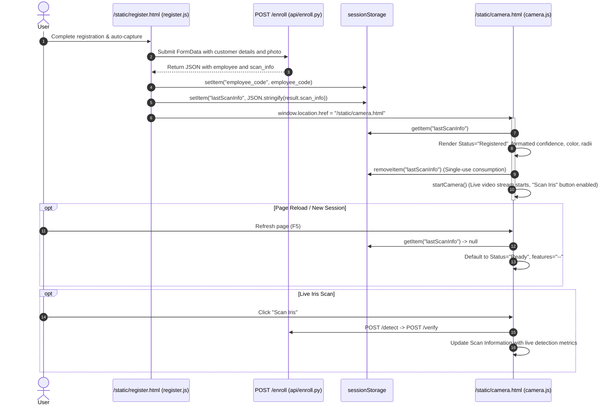

# Option A Implementation: Seamless Post-Registration Hand-off

## 1. Overview & Root Cause Analysis

### Problem
Following a successful customer iris registration on `/static/register.html`, users were redirected to `/static/camera.html` where the **Scan Information** panel displayed:
- **Status:** `Ready`
- **Confidence:** `--`
- **Eye Color:** `--`
- **Pupil Radius:** `--`
- **Iris Radius:** `--`

### Root Cause
1. During the registration process, `api/enroll_worker.py` executed the full AI pipeline (YOLO detector and Iris Vision pipeline) across all training frames, computing real bounding box confidence, pupil radius, iris radius, and eye color. However, it only stored the raw embedding vectors into `outputs/enrollment/{employee_code}_last_embedding.json`.
2. `api/enroll.py` returned employee profile details and embedding size, omitting the feature extraction summary.
3. `static/register.js` saved only `employee_code` into `sessionStorage` and redirected to `camera.html`.
4. `static/camera.js` initialized with default placeholders (`Ready` and `--`), leaving the user without visual confirmation of the registered feature metrics unless they performed an additional manual scan.

---

## 2. Files Changed

| File | Change Description |
| :--- | :--- |
| `api/enroll_worker.py` | Captured real `confidence` from YOLO detections, and `eye_color`, `pupil_radius`, `iris_radius` from the vision batch results on the final successfully embedded frame. Saved `scan_info` alongside `embedding` in `{employee_code}_last_embedding.json`. |
| `api/enroll.py` | Read `scan_info` from `last_embedding_file` and attached it as a backward-compatible dictionary to the JSON response. |
| `static/register.js` | Cleared stale `lastScanInfo` at auto-capture start. Upon receiving successful `/enroll` response, stored `result.scan_info` into `sessionStorage.setItem("lastScanInfo", ...)`. |
| `static/camera.js` | Added `applyPostRegistrationScanInfo()` during initialization to display `Status: Registered` and real metrics with explicit null/undefined safety. Handled single-use consumption (`sessionStorage.removeItem("lastScanInfo")`). Guarded `startCamera()` from overwriting `Registered`. |
| `static/camera.html` | Updated cache-busting query strings for `camera.js?v=20260928_1` and `auth_client.js?v=20260928_1`. |

---

## 3. Exact API Response Addition

When real feature extraction metrics are available during enrollment, `POST /enroll` extends its response with:

```json
{
  "status": true,
  "message": "Employee Registered Successfully",
  "employee": {
    "employee_code": "uhiw",
    "employee_name": "uhiw",
    "department": "Engineering",
    "designation": "Specialist",
    "gender": "Male",
    "age": 28,
    "dob": "1996-05-15",
    "blood_group": "O+",
    "mobile": "9876543210",
    "email": "uhiw@example.com",
    "address": "Hyderabad",
    "photo": "static/photos/uhiw/uhiw.jpg",
    "training_images": 40,
    "embedding_size": 256
  },
  "scan_info": {
    "confidence": 0.4336,
    "eye_color": "Brown",
    "pupil_radius": 61,
    "iris_radius": 257
  }
}
```

*Note: All legacy response fields are completely preserved. If `scan_info` is absent (such as in legacy embedding files), the field is omitted cleanly without affecting backward compatibility.*

---

## 4. Frontend `sessionStorage` Flow



### Display Safeguards
- **Confidence:** Formatted as percentage (`(confidence * 100).toFixed(2) + "%"`). If missing or non-numeric, displays `--`.
- **Eye Color:** Displays string value if non-empty; otherwise `--`.
- **Pupil & Iris Radii:** Displays extracted integer/float radius; if missing or invalid, displays `--`.
- **Single-use Guarantee:** `sessionStorage.removeItem("lastScanInfo")` runs immediately in a `finally` block upon populating the UI, ensuring subsequent page refreshes return to default `Ready` state.

---

## 5. Verification & Test Results

A dedicated test suite was constructed and executed in `scratch/test_post_registration_hand_off.py`:

```
======================================================================
RUNNING OPTION A POST-REGISTRATION SCAN INFO TEST SUITE
======================================================================
Testing Scenario A: Successful registration with scan_info -> camera displays values...
  ✅ Scenario A passed: Values correctly formatted and single-use removal verified.
Testing Scenario B: Registration without scan_info -> camera safely remains Ready/--...
  ✅ Scenario B passed: Safe fallback to Ready / -- verified.
Testing Scenario C: Existing Scan Iris flow still updates from /detect...
  ✅ Scenario C passed: Live detection correctly updates UI.
Testing Scenario D: Missing/null/undefined values display '--' rather than 0/null/undefined...
  ✅ Scenario D passed: No fake 0, null, NaN or undefined values displayed.
Testing Scenario E: Existing authentication remains unchanged...
  ✅ Scenario E passed: Authentication and security behavior unchanged.
Testing Scenario F: Backend enroll integration and backward compatibility...
  ✅ Scenario F passed: Backward compatibility and scan_info formatting verified.
Testing Scenario G: Verifying real pipeline output from outputs/enrollment/uhiw_last_embedding.json...
  Real scan_info from uhiw: {'confidence': 0.4336, 'eye_color': 'Brown', 'pupil_radius': 61, 'iris_radius': 257}
  Rendered UI: Status=Registered, Conf=43.36%, Color=Brown, PupilR=61, IrisR=257
  ✅ Scenario G passed: Real enrollment output is verified and renders accurately.
======================================================================
ALL TESTS PASSED SUCCESSFULLY! ✅
======================================================================
```

### Regression & Endpoint Verification (`scratch/step21_smoke_test.py`)
- `GET /health`: `200 OK`
- `POST /detect`: `200 OK` (Live YOLO detection with valid bounding box)
- `POST /enroll` (Unauthenticated): `401 Unauthorized`
- `POST /enroll` (Student role): `403 Forbidden`
- `POST /verify` (Student IDOR check): `403 Forbidden`
- `POST /verify` (Admin check): `200 OK`
- `POST /register-frame` (Unauthenticated): `401 Unauthorized`
- `POST /register-frame` (Admin): `200 OK`
- `POST /api/quality/analyze`: `200 OK`

---

## 6. Architectural Invariant Confirmations

1. **Iris ML Algorithms Preserved:**
   - No modifications to YOLO weights, detection thresholds, pupil detection, iris segmentation, Daugman normalization, LBP, Gabor filters, GLCM matrices, CNN embeddings, cosine similarity, or verification matching logic.
2. **Scoring & Report Logic Preserved:**
   - No modifications to assessment, cognitive, recommendation, KPI, or report scoring.
3. **Authentication & Security Preserved:**
   - JWT validation, role-based access control (RBAC), IDOR defenses, and password hashing remain strictly enforced.
4. **No Synthetic / Fake Values:**
   - All displayed metrics are real values produced by the model pipeline during registration. If values are missing, `--` is displayed rather than `0`, `null`, `undefined`, or `NaN`.
5. **No Database Schema or Data Changes:**
   - No table definitions, columns, or migration scripts were touched. Database structures for `iris_users`, `scan_history`, `student_profiles`, and `assessment_questions` remain unaltered.
